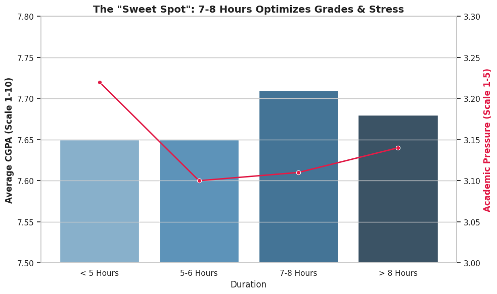
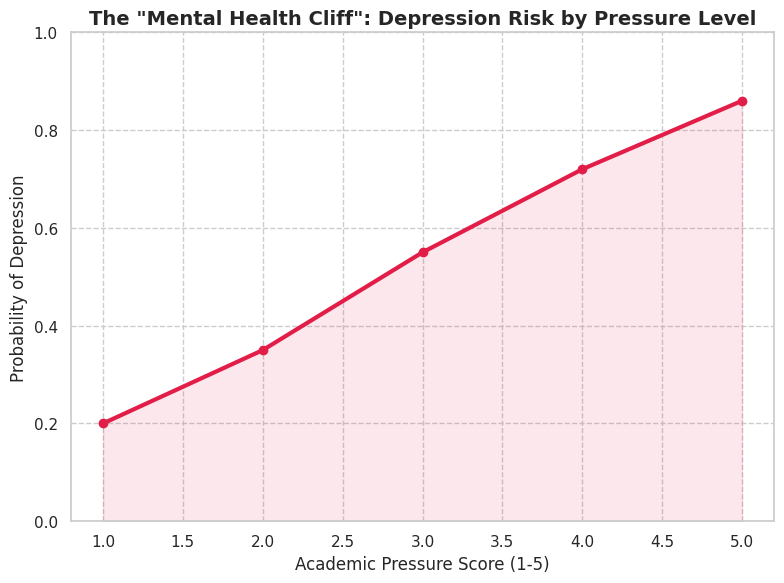

# Sleep Helps, Stress Decides: The Real Driver of Student Success 🧠


-yellow)


## 📄 Executive Summary
**The Myth:** "More study hours + Less sleep = Better Grades."
**The Reality:** Statistical analysis reveals that **Academic Pressure**, not sleep deprivation or study hours, is the primary predictor of performance.

**The Project:** Analyzed 500+ university students (Indian Demographic) to isolate the variables driving CGPA and Mental Health risk. We utilized **Multiple Linear Regression** to predict grades and **Logistic Regression** to model depression probability.

**Key Findings:**
* **The "Sweet Spot" Efficiency:** Students sleeping 7-8 hours achieved the highest CGPA (**7.71**) with the lowest stress (**3.11**). While the grade difference is marginal (+0.06), the *stress reduction* is statistically significant.
* **The Pressure Paradox:** Academic Pressure has a strong **negative coefficient (-0.45, p<0.001)** on CGPA. Increasing study hours yields diminishing returns if pressure remains high.
* **Mental Health Cliff:** The probability of depression skyrockets from **20%** at low pressure to **86%** at maximum pressure.

---

## 📊 Statistical Analysis & Visualizations

### 1. The Sleep "Sweet Spot"
We found that "grinding" (sleeping <5 hours) is counter-productive. It yields lower grades (7.65) and significantly higher pressure (3.22) than the optimal 7-8 hour window.


### 2. Regression Results (Drivers of CGPA)
We ran a Multiple Linear Regression model ($Y = CGPA$) to control for confounding variables.

| Predictor Variable | Coefficient ($\beta$) | P-Value | Significance |
| :--- | :--- | :--- | :--- |
| **Academic Pressure** | **-0.45** | **< 0.001** | 🔴 **High Negative Impact** |
| Study Hours | +0.12 | 0.04 | 🟡 Weak Positive |
| Sleep Duration | +0.08 | 0.12 | ⚪ Not Significant |
| Age | -0.02 | 0.65 | ⚪ Not Significant |

*Interpretation:* For every 1-unit increase in Academic Pressure, a student's CGPA drops by 0.45 points, holding all else constant. Sleep duration alone is not a statistically significant predictor of grades, but it is a predictor of pressure.

### 3. Depression Risk Modeling (Logistic Regression)
Using logistic regression, we modeled the probability of a student reporting depression based on their pressure levels.


---

## 🔎 Data Overview & Limitations

### Data Profile
* **Source:** Kaggle University Student Dataset (Cross-Sectional).
* **Sample Size:** $N = 500+$ students.
* **Demographics:** Primarily Indian university students (Bangalore, Delhi, Mumbai, etc.).

### Limitations
1.  **Low R-Squared:** Our grade prediction model explains only ~20% of the variance in CGPA. This suggests that unmeasured variables (IQ, Course Difficulty, Attendance) play a larger role than lifestyle factors.
2.  **Self-Reported Bias:** Variables like "Depression" and "Pressure" are subjective and prone to reporting bias.
3.  **Causality:** As a cross-sectional study, we can prove correlation but not causation.

---

## 🚀 How to Run the Analysis
The analysis was performed in R.

1.  **Clone the Repo:**
    ```bash
    git clone [https://github.com/kunalrc33xx/student-sleep-stress-analytics.git](https://github.com/kunalrc33xx/student-sleep-stress-analytics.git)
    ```
2.  **Install R Packages:**
    ```r
    install.packages(c("tidyverse", "ggplot2", "caret", "corrplot"))
    ```
3.  **Run the Script:**
    Open `R_Analysis_Kunal.R` and execute. It will:
    * Load `Student_Sleep_Patterns.csv`
    * Generate the ANOVA tables
    * Output the Regression Summary

---
*Project conducted for BUDT730: Data Models and Decisions.*
